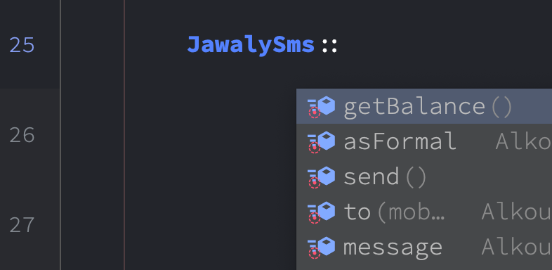

<p align="center">

[](//packagist.org/packages/alkoumi/laravel-4jawaly-sms)
[](//packagist.org/packages/alkoumi/laravel-4jawaly-sms)


</p>

## مكتبة لارافيل لمزود خدمة الرسائل القصيرة فور جوالي

## Laravel 4Jawaly sms Library https://www.4jawaly.net

This is a Laravel 🔥 package to send SMS using https://www.4jawaly.net 🥳 account

## Installation

1. Install the package using composer:

- for apps with ```Laravel 8``` and before:

```
composer require alkoumi/laravel-4jawaly-sms:1.4
```

- for apps from ```Laravel 9``` :

```
composer require alkoumi/laravel-4jawaly-sms
```

2. The service provider will automatically registered. Or you may manually do in your `config/app.php` file:

```
'providers' => [
          //...
          Alkoumi\Laravel4jawalySms\Laravel4jawalySmsServiceProvider::class,
    ];
```

3. Publish 🥳 the configuration 💼 file using this command:

```
php artisan vendor:publish --provider='Alkoumi\Laravel4jawalySms\Laravel4jawalySmsServiceProvider'
```

4. In your `.env` file add your https://www.4jawaly.net credentials details like:

```
4JAWALY_SMS_USERNAME=@username
4JAWALY_SMS_PASSWORD=@password
4JAWALY_SMS_FORMALSENDER=@formal-sender
4JAWALY_SMS_ADSSENDER=@Ads-sender
4JAWALY_SMS_ADMINEMAIL=me@domain.com
```

5- Don't forget to `php artisan optimize:clear` after editing `.env` file

## Usage [ as elegant as Laravel 🔥 ] with auto compeletion by ide-helper



```
 use Alkoumi\Laravel4jawalySms\Facades\JawalySms;
 
    $message = 'جعل الله ما قدمتكم نهرًا جاريًا من الحسنات';
    
    
    # in multiple Lines with collection
    JawalySms::message($message)                // 🔥 { required } the test message to send
            ->to(User::all())                   // 🔥 { required } as Mixed|array|object|collection
            ->asFormal()                        // { optional } the Ads-sender used by default unless you add ->asFormal() 
            ->send();                           // 🔥 { required } at the end to send 🧐
            
            
   # in One Liner with Builder
   JawalySms::message($message)->to(DB::table('users')->get())->send();
```

## Usage in `.blade.php` files get your Balance 😉

```
    {{ JawalySms::getBalance() }}         // Return poients (int) 134534
```

1- For one recipient, You must pass types `Mixed|Array` like `->to('0500175200')` or `->to(['0500175200'])`.

2- If you have `database` field `$user->mobile` then you can pass types `Array|Object|Collection|Builder`.

3- For multiple recipients, Just pass types `Array|Object|Collection` in `->to(User::all())`.

4- If you pass types of `Array|Object|Collection`, We will tack care 😎 of getting mobile numbers.

5- By default Ads sender name will used, unless you add `->asFormal()` to use formal sender name from https://www.4jawaly.net.

6- Add `admin_email` in  `.env` OR `config\4jawaly-sms.php` to notify Admin with results in every request.

## Unit Testing

1- cd to the package directory and ``` composer install ```.

2- Add you 4Jawaly account details in ``` SMSTestCase::class ``` in ``` protected function defineEnvironment($app) ```.

3- run ``` vendor/bin/phpunit --filter ``` ENJOY 🤩🥳.

#### Give Me 💗 Cup of ☕️ Coffee here https://patreon.com/mohammadelkoumi
